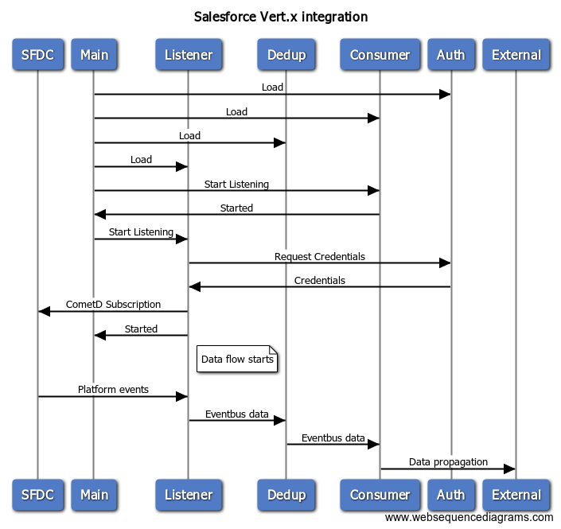

# Salesforce vert.x integration

[ ](https://app.codeship.com/projects/257955)

Collection of verticles that enable interaction with the Salesforce API.<br />
Artifacts on [Maven Central](https://search.maven.org/#search%7Cga%7C1%7Cg%3A%22net.wissel.salesforce%22)

Eclipse [vert.x](http://vertx.io) is a lightweight Java framework for micro services architectures.
It features an event bus that allows polyglot vert.x modules (called Verticles) to communicate
with each other. This allows building well scaling modules for API driven application.

There is extensive documentation available at the Eclipse [vert.x](http://vertx.io) project page.

## Sample application
A sample application including the corresponding Salesforce artifacts is available [here](https://github.com/stwissel/sfdc-vertx-sample)

## Overview


## Detail pages
- [Eventbus usage](eventbus.md)
- [Authentication and Authorization](auth.md)
- [Configuration and Setup](configure.md)
- [Event deduplication](dedup.md)

## Available Verticles
- [Authentication Verticles](verticles/auth.md)
- [Subscription to platform events Verticles](verticles/platform.md)
- [Send result to console Verticle](verticles/console.md)
- [Send result to websocket Verticle](verticles/websocket.md)
- [Main/Setup Verticle](verticles/main.md)
- [Deduplication Verticles](verticles/dedup.md) (including [Redis](verticles/redis.md))

## Write your own
- [Listeners](contribute/listener.md)
- [Deduplication](contribute/dedup.md)
- [Consumers](contribute/consumer.md)
- [Auth](contribute/auth.md)

## How does it work

One or more [listener](contribute/listener.md) Verticles *connect* to a Salesforce instance. This can be development, sandbox or production.
The listeners will register for the configured events and publish incoming data to the vert.x eventbus. To gain access a listener requests [Authorization](auth.md) from an [Auth Verticle](contribute/auth.md).

The [listener](verticles/platform.md) might initially publish the incoming data to a [Deduplication](dedup.md) service, to filter out events that are considered duplicates.
This allows restarting listeners, cluster listeners or recover from failover. The core package contains a sample in-memory [deduplication](verticles/dedup.md) verticle -
 in a production environment you want to use something storage backed like the [Redis Dedup](verticles/redis.md) service.

Zero or more [consumers](contribute/consumer.md) listen to the eventbus and do with the incoming data what they have to do.

As sample a [consumer](verticles/websocket.md) that forwards the payload to a websocket and one that just prints to the console is provided. 

The flow is supported by one or more [Authentication](auth.md) verticles.
The main one of type [SoapApi](verticles/auth.md) retrieves the session information from Salesforce.

A second one "Basic" is provided to allow Verticles to retrieve basic Auth. e.g. for use in a JSON POST in a listener.

Finally the ApplicationStarter Verticle loads the configuration file "[SFDCOptions.json](configure.md)" and all verticles described in it.

## [Eventbus](eventbus.md)

The SFDC verticles make heavy use of the [eventbus](eventbus.md).

 After loading all configured verticles, the main verticle sends a start signal on the bus. The SFDC verticles can be configured to start listening only after the start signal has been sent. This allows to spin up the consumers before the listeners start taking incoming events.

 The authentication verticles listen to the [eventbus](eventbus.md) to provide the HTTP header and destination server for listener or consumer verticles. Listener or consumer verticles are shielded from the details of authentication/authorization

 The listeners publish their received data onto the [eventbus](eventbus.md). They either use the configured destination address or the address of a [deduplication service](dedup.md), which prevents identical events from being forwarded to consumers twice.

 Last not least: the main verticle uses the [eventbus](eventbus.md) to signal the verticles to stop listening. This allows to shutdown the listeners and let the bus drain from messages before shutting down.

## Setup

Add this dependencies to your `pom.xml`:

```
<dependency>
	<groupId>net.wissel.salesforce</groupId>
	<artifactId>vertx-sfdc-core</artifactId>
	<version>0.3.1</version>
</dependency>
<!-- Optional for deduplication service if Redis is your choice -->
<dependency>
	<groupId>net.wissel.salesforce</groupId>
	<artifactId>vertx-sfdc-redis</artifactId>
	<version>0.3.1</version>
</dependency>
```

Then [configure the `sfdcoptions.json`](configure.md) file

## Start
Start the verticle `net.wissel.salesforce.vertx.ApplicationStarter` to launch the configured listener and consumers

## Feedback
I would love to hear about your implementation or ideas or challenges, so 
[open an issue on GitHub](https://github.com/Stwissel/vertx-sfdc-platformevents/issues) - even for sharing success. Don't be shy!